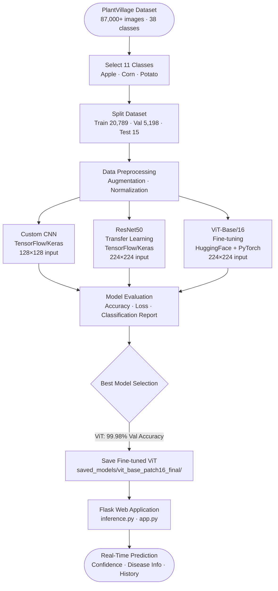
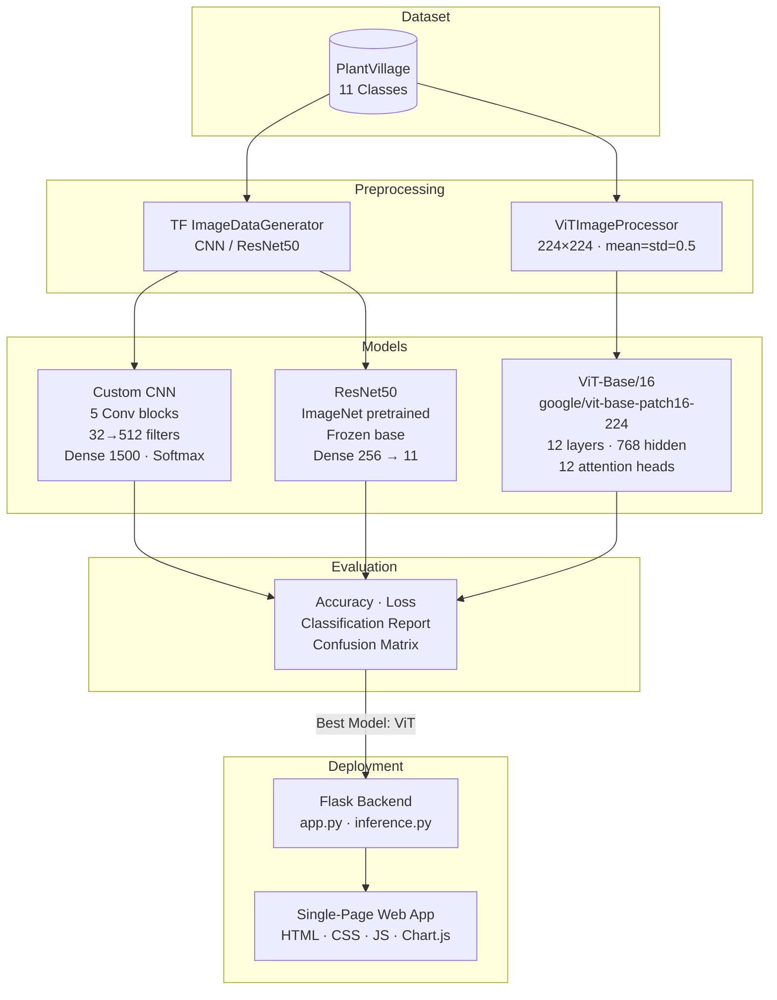

# PhytoGuard AI — Plant Disease Detection

AI-powered plant disease classification using a fine-tuned Vision Transformer (ViT), comparing CNN, ResNet50, and ViT across 11 disease classes in Apple, Corn, and Potato crops.

---

## Overview

Crop diseases cause billions of dollars in agricultural losses annually. Early, accurate identification is critical — yet traditionally requires expert agronomists on-site. **PhytoGuard AI** addresses this by:

1. Training and benchmarking three deep learning architectures (Custom CNN, ResNet50, Vision Transformer) on a curated subset of the PlantVillage dataset.
2. Selecting the best-performing model (ViT-Base/16, 99.98% validation accuracy) for deployment.
3. Serving real-time predictions through a Flask web application where users upload a leaf image and receive an instant diagnosis with confidence scores, disease information, symptoms, causes, treatment, and prevention guidance.

---

## Key Features

- Three models trained, evaluated, and compared head-to-head
- Fine-tuned `google/vit-base-patch16-224` achieves **99.98% validation accuracy**
- Flask REST API with structured JSON responses (`/predict`, `/model-info`, `/history`, `/samples`)
- Image validation: minimum size check + blur detection via Laplacian variance
- Session-based prediction history (up to 20 entries) with base64 thumbnails
- Top-3 confidence breakdown returned per prediction
- Per-class disease database with symptoms, causes, treatment, and prevention (JSON-backed)
- Device-aware inference: Apple MPS → CUDA → CPU fallback
- Built-in sample images served from the `test/` directory for quick testing
- Optimized for Apple Silicon (M4 Mac) with Metal/MPS GPU acceleration

---

## Project Workflow



---

## Project Architecture



---

## Tech Stack

| Category | Technologies |
|---|---|
| Language | Python 3 |
| Deep Learning (CNN/ResNet50) | TensorFlow-macOS 2.16.2, Keras |
| Deep Learning (ViT) | PyTorch 2.9.1, HuggingFace Transformers 4.57.1 |
| GPU Acceleration | Apple Metal (tensorflow-metal 1.2.0), MPS (Apple Silicon) |
| Data Science | NumPy, Pandas, scikit-learn, Matplotlib, Seaborn |
| Image Processing | Pillow, OpenCV |
| Web Framework | Flask ≥ 3.0, Werkzeug ≥ 3.0 |
| Frontend | HTML5, CSS3, Vanilla JavaScript, Chart.js 4.4 |
| Notebooks | Jupyter (VS Code) |
| Prototyping UI | Streamlit (main.py — early prototype) |

---

## Folder Structure

```
PHYTO_Guard/
├── train/                          # Training images (20,789 · 11 classes)
├── valid/                          # Validation images (5,198 · 11 classes)
├── test/                           # Test images (15 samples for webapp demo)
│
├── TRAIN_CNN_MODEL.ipynb           # Custom CNN training
├── TRAIN_RESNET50_MODEL.ipynb      # ResNet50 transfer learning training
├── TRAIN_VIT_MODEL.ipynb           # ViT fine-tuning (HuggingFace Trainer)
│
├── evaluate_CNN_model.ipynb        # CNN evaluation + confusion matrix
├── evaluate_RESNET50_model.ipynb   # ResNet50 evaluation + confusion matrix
├── TEST_CNN_RESNET50_MODEL.ipynb   # CNN & ResNet50 test inference
├── TEST_VIT_MODEL.ipynb            # ViT test inference
│
├── Model_Comparison_PhytoGuard.ipynb  # Head-to-head comparison + plots
│
├── trained_model.keras             # Saved CNN model (~89 MB)
├── resnet50_model.keras            # Saved ResNet50 model (~96 MB)
├── training_hist.json              # CNN training history (10 epochs)
├── training_RESNET50_history.json  # ResNet50 training history (10 epochs)
│
├── saved_models/
│   ├── vit_base_patch16_final/     # Fine-tuned ViT (safetensors + config)
│   ├── vit_base_label_mappings.json
│   ├── vit_base_training_history.json
│   └── vit_base_classification_report.json
│
├── vit_base_model_output/          # HuggingFace Trainer checkpoints
│
├── webapp/
│   ├── app.py                      # Flask backend (routes + history)
│   ├── inference.py                # ViT inference pipeline
│   ├── disease_info.py             # Disease database helper
│   ├── disease_info.json           # Per-class disease data (11 classes)
│   ├── requirements_webapp.txt
│   ├── run.sh                      # Single-command launcher
│   ├── templates/index.html        # Single-page application
│   └── static/
│       ├── css/style.css
│       └── js/app.js
│
├── main.py                         # Streamlit prototype (early version)
├── requirements.txt                # Training environment dependencies
├── m4_tensorflow_env_info.md       # M4 Mac environment setup guide
└── m4_tensorflow/                  # Python virtual environment
```

---

## Dataset

| Property | Value |
|---|---|
| Source | PlantVillage (via Kaggle) |
| Original size | 87,000+ images · 38 classes |
| Classes selected | **11** (Apple, Corn/Maize, Potato) |
| Training images | 20,789 |
| Validation images | 5,198 |
| Test images | 15 (hand-picked samples) |
| Image format | RGB JPG |

**11 Classes:**

| # | Class |
|---|---|
| 1 | Apple — Apple Scab |
| 2 | Apple — Black Rot |
| 3 | Apple — Cedar Apple Rust |
| 4 | Apple — Healthy |
| 5 | Corn (Maize) — Gray Leaf Spot (Cercospora) |
| 6 | Corn (Maize) — Common Rust |
| 7 | Corn (Maize) — Northern Leaf Blight |
| 8 | Corn (Maize) — Healthy |
| 9 | Potato — Early Blight |
| 10 | Potato — Late Blight |
| 11 | Potato — Healthy |

---

## Models Implemented

| Model | Architecture | Framework | Input Size | Epochs | Parameters |
|---|---|---|---|---|---|
| Custom CNN | 5 Conv blocks (32→512 filters), Dense 1500, Softmax | TensorFlow / Keras | 128×128 | 10 | Custom |
| ResNet50 | ImageNet pretrained base (frozen) + Dense 256 + Softmax | TensorFlow / Keras | 224×224 | 10 | ~25M |
| ViT-Base/16 | `google/vit-base-patch16-224` fine-tuned, 12 layers, 768 hidden, 12 heads | PyTorch + HuggingFace | 224×224 | 10 | ~86M |

---

## Results

All metrics are taken directly from training history JSON files and the ViT classification report.

| Model | Final Train Accuracy | Best Val Accuracy | Final Val Loss |
|---|---|---|---|
| Custom CNN | 98.21% | 98.13% | 0.0546 |
| ResNet50 | 99.50% | 98.98% | 0.0254 |
| **ViT-Base/16** | **—** | **99.98%** | **0.0024** |

> **Best model: ViT-Base/16** — 99.98% validation accuracy (on 5,198 images), macro-average F1-score of 99.98%, across all 11 classes.

The ViT's fine-tuned classification report (from `saved_models/vit_base_classification_report.json`) shows near-perfect precision and recall across every class on the full 5,198-image validation set.

### Validation Accuracy over Epochs


### Bar Chart Comparison


### Train vs. Validation Accuracy (Overfitting Check)


---

## Screenshots

### Web Application — Disease Detection


### Disease Information Panel


---

## Installation

### 1. Clone the repository

```bash
git clone https://github.com/<your-username>/PHYTO_Guard.git
cd PHYTO_Guard
```

### 2. Create and activate the virtual environment

```bash
python3 -m venv m4_tensorflow
source m4_tensorflow/bin/activate
```

### 3. Install dependencies

For training notebooks:
```bash
pip install -r requirements.txt
```

For the web application only:
```bash
pip install -r webapp/requirements_webapp.txt
```

> **Note:** The ViT training notebook requires `torch`, `transformers`, and `accelerate`. These are listed in the environment info (`m4_tensorflow_env_info.md`). The environment was built for Apple Silicon (M4 Mac) with Metal/MPS GPU support. Adjust for your hardware as needed.

---

## Usage

### Training

Open any training notebook in Jupyter (with the `m4_tensorflow` kernel selected):

| Notebook | Purpose |
|---|---|
| `TRAIN_CNN_MODEL.ipynb` | Train the custom CNN |
| `TRAIN_RESNET50_MODEL.ipynb` | Train ResNet50 (transfer learning) |
| `TRAIN_VIT_MODEL.ipynb` | Fine-tune ViT-Base/16 |

Run all cells top-to-bottom. Trained models are saved to the project root and `saved_models/`.

### Evaluation & Testing

| Notebook | Purpose |
|---|---|
| `evaluate_CNN_model.ipynb` | CNN — accuracy, loss curves, confusion matrix |
| `evaluate_RESNET50_model.ipynb` | ResNet50 — accuracy, loss curves, confusion matrix |
| `TEST_CNN_RESNET50_MODEL.ipynb` | CNN & ResNet50 — inference on test images |
| `TEST_VIT_MODEL.ipynb` | ViT — inference on test images |
| `Model_Comparison_PhytoGuard.ipynb` | Head-to-head comparison plots |

### Web Application

**Option 1 — Single-command launcher (recommended):**

```bash
bash webapp/run.sh
```

**Option 2 — Manual:**

```bash
source m4_tensorflow/bin/activate
cd webapp
python app.py
```

Open your browser at: **http://localhost:5001**

The app loads the fine-tuned ViT model on startup and serves predictions via `POST /predict`.

---

## Future Improvements

- Expand the dataset to cover more of the original 38 PlantVillage classes
- Add Grad-CAM or attention map visualizations to show which leaf regions triggered the prediction
- Package the web application with Docker for cross-platform deployment
- Implement model quantization to reduce ViT inference latency on CPU
- Explore data augmentation strategies (CutMix, MixUp) to further close the gap between CNN/ResNet50 and ViT performance

---

## Author

**Name:** Madhav Khaitan  
**LinkedIn:** [linkedin.com/in/your-profile](https://linkedin.com/in/your-profile)  
**GitHub:** [github.com/madhavkhaitan1105](https://github.com/madhavkhaitan1105)
