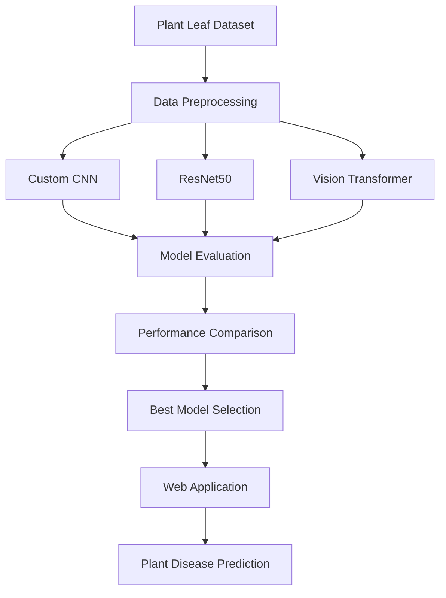
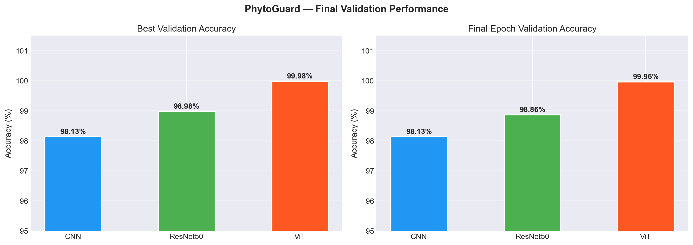
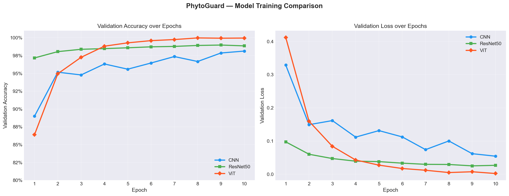
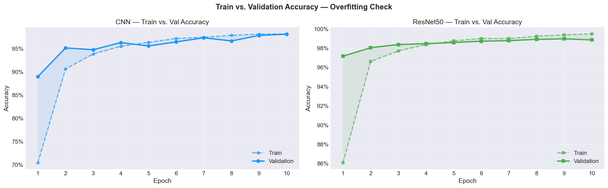
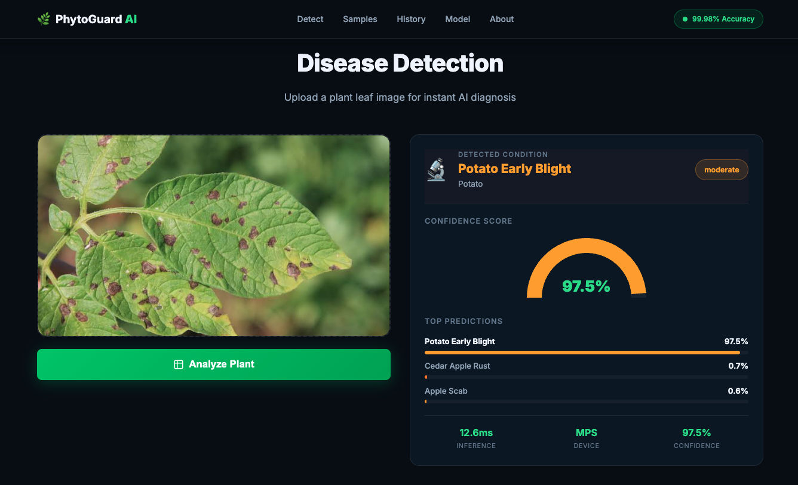

#  PhytoGuard – Plant Disease Detection using Deep Learning

PhytoGuard is a deep learning-based plant disease detection system developed to identify diseases in crop leaves from images. The project focuses on training, evaluating, and comparing multiple deep learning architectures to determine the most effective model for disease classification. The best-performing model is then integrated into a lightweight web application for real-time predictions.

---

##  Overview

Plant diseases can significantly reduce crop yield and quality if not identified at an early stage. Manual disease diagnosis requires agricultural expertise and may not always be accessible to farmers.

This project explores the use of deep learning for automated plant disease classification by training and comparing three different image classification models:

- Custom Convolutional Neural Network (CNN)
- ResNet50 (Transfer Learning)
- Vision Transformer (ViT)

Each model was trained and evaluated on the same dataset to compare their performance. After benchmarking all three models, the best-performing model was deployed through a simple web application that allows users to upload leaf images and receive disease predictions.

---

##  Features

- Trained and evaluated three deep learning models
- Performance comparison between CNN, ResNet50, and Vision Transformer
- Fine-tuned Vision Transformer for high-accuracy classification
- Lightweight web application for real-time disease prediction
- Disease information displayed alongside predictions
- Model comparison through training and validation graphs

---

# Deep Learning Pipeline



---

# Models Implemented

| Model | Description |
|--------|-------------|
| **Custom CNN** | Baseline convolutional neural network trained from scratch. |
| **ResNet50** | Transfer learning using a pretrained ResNet50 backbone. |
| **Vision Transformer (ViT)** | Transformer-based image classification model fine-tuned for plant disease detection. |

---

# Model Comparison

The primary objective of this project was to compare the performance of different deep learning architectures on the same plant disease dataset.

The following aspects were evaluated:

- Training Accuracy
- Validation Accuracy
- Training Loss
- Validation Loss
- Overall Classification Performance

The trained models were analyzed to determine the most suitable architecture for deployment.

---

# Results

After comparing all three architectures, the **Vision Transformer (ViT)** achieved the best overall performance and was selected for deployment in the web application.

The project includes:

- Performance comparison graphs
- Training and validation curves
- Individual model evaluation notebooks
- Comparative analysis notebook

---

## 📊 Performance Visualizations

### Model Comparison





### Accuracy & Loss Curves




### Train vs Validation Performance




---

# Web Application

To demonstrate the trained model, a simple web application was developed.

The web application allows users to:

- Upload an image of a plant leaf
- Predict the disease using the trained model
- View the predicted class
- View confidence score
- Display disease-related information

> **Note:**  
> The web application is only an interface for inference.  
> The primary contribution of this project is the training, evaluation, and comparison of multiple deep learning models.

---

## Web Application Preview




---

# Tech Stack

| Category | Technologies |
|----------|--------------|
| Programming Language | Python |
| Deep Learning | TensorFlow, Keras, PyTorch |
| Transfer Learning | ResNet50 |
| Transformer Model | Vision Transformer (ViT) |
| Computer Vision | OpenCV |
| Data Processing | NumPy, Pandas |
| Visualization | Matplotlib, Seaborn |
| Web Framework | Flask |
| Frontend | HTML, CSS, JavaScript |
| Development | Jupyter Notebook |

---

# Project Structure

```
PHYTO_Guard/
│
├── train/
├── valid/
├── test/
│
├── webapp/
│
├── saved_models/
├── vit_base_model_output/
│
├── TRAIN_CNN_MODEL.ipynb
├── TRAIN_RESNET50_MODEL.ipynb
├── TRAIN_VIT_MODEL.ipynb
│
├── evaluate_CNN_model.ipynb
├── evaluate_RESNET50_model.ipynb
├── TEST_CNN_RESNET50_MODEL.ipynb
├── TEST_VIT_MODEL.ipynb
│
├── Model_Comparison_PhytoGuard.ipynb
│
├── requirements.txt
└── README.md
```

---

# Installation

Clone the repository

```bash
git clone https://github.com/your-username/PhytoGuard.git
```

Move into the project directory

```bash
cd PhytoGuard
```

Install the required dependencies

```bash
pip install -r requirements.txt
```

---

# Running the Project

### Train Models

Run the respective notebooks:

- `TRAIN_CNN_MODEL.ipynb`
- `TRAIN_RESNET50_MODEL.ipynb`
- `TRAIN_VIT_MODEL.ipynb`

---

### Evaluate Models

Run:

- `evaluate_CNN_model.ipynb`
- `evaluate_RESNET50_model.ipynb`
- `Model_Comparison_PhytoGuard.ipynb`

---

### Launch the Web Application

```bash
cd webapp
python app.py
```

Open your browser and navigate to:

```
http://localhost:5001
```

---

# Future Improvements

- Extend support to more crop species
- Increase dataset diversity
- Deploy as a cloud-based application
- Optimize models for mobile devices
- Add explainable AI techniques such as Grad-CAM
- Develop a mobile application for field use

---

# Author

**Madhav Khaitan**

Computer Science Engineering (AI & ML)

Manipal University Jaipur

GitHub: https://github.com/madhavkhaitan1105

LinkedIn: https://www.linkedin.com/in/madhavkhaitan
